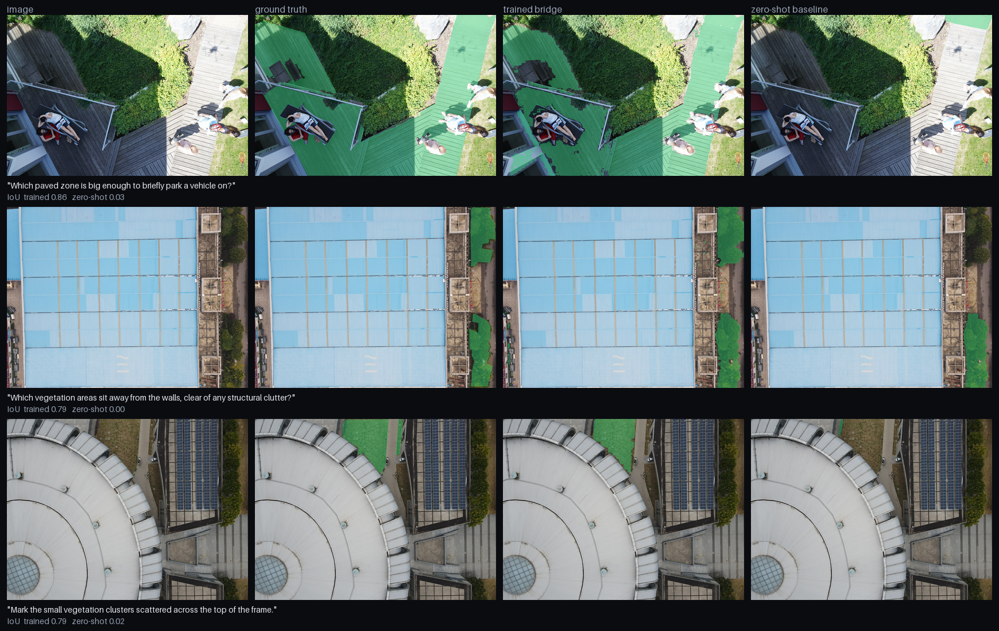

# Voxae

**Language-grounded scene understanding for physical AI.**

Ask an aerial scene a question in plain language and get back the exact pixels that answer it.
A perception primitive for embodied agents (drones, robots, autonomous systems), demonstrated on drone-captured scenes.

[](https://huggingface.co/spaces/nhibuilds/voxae)
[](https://github.com/nhipixel/voxae/actions)
[](LICENSE)

**[Try it](https://huggingface.co/spaces/nhibuilds/voxae).** Both models run on the same query, side by side.


## Why

A perception model answers only the questions someone fixed at annotation time. A class list is decided months before deployment, and every new question costs another labeling round. Outside a warehouse, the questions are not enumerable in advance.

Voxae makes the question an input instead of a training decision.

Three query families:

- **Referring**: "the building with the red roof"
- **Affordance**: "where could a small drone land safely?"
- **Metric**: "is this gap wide enough for a 2.5 m vehicle?"

## How it works

```
image + query
    │
    ▼  vision-language model (Qwen2-VL-2B, LoRA)
hidden state at a <SEG> token
    │
    ▼  2-layer MLP projector
SAM 2.1 sparse prompt embedding
    │
    ▼  mask decoder
binary mask
```

The language model never describes a region in words. Its hidden state at a special `<SEG>` token is projected directly into SAM 2.1's prompt space, so the gradient from a wrong pixel flows back through the projector and into the language model. Trained end to end with LoRA under cross-entropy + BCE + Dice.

A **zero-shot compose baseline** ships alongside it: a hosted VLM emits a bounding box and points as text, SAM 2.1 turns them into a mask, no training. It is the floor the trained bridge has to beat, and the demo runs both on the same query so the difference is visible rather than described.

Full details: [`docs/architecture.md`](docs/architecture.md).

## Results

Held-out test split, 306 samples, both predictors on identical inputs.

| | gIoU trained | gIoU zero-shot | cIoU trained | cIoU zero-shot |
|---|---|---|---|---|
| all | **0.414** | 0.371 | **0.502** | 0.307 |
| referring | 0.399 | **0.538** | 0.393 | **0.494** |
| affordance | **0.421** | 0.290 | **0.511** | 0.290 |

**The split is the result.** A hosted VLM emitting a box is strong at naming an object and weak at reasoning about what a query implies: it wins referring by 26% and loses affordance by 45%. A single box cannot express a disjoint or proximity-constrained region; a projected embedding can.

| | trained | zero-shot |
|---|---|---|
| latency / query | **0.25 s** | 20.8 s |
| unparseable responses | **0** | 1 / 306 |

Inference is one teacher-forced forward pass with no autoregressive generation. The baseline pays an API round trip plus a full SAM encode, and can emit output that fails to parse at all, a failure mode an embedding handoff does not have.

Trained in **42 minutes on one 24 GB GPU** (L4, bfloat16, LoRA r=16) on a 2B-parameter backbone. The whole pipeline is reproducible on a single consumer-grade accelerator.

The baseline's output parser accepts both array and object forms of boxes and points, and takes the first object when a model returns several. An earlier strict schema produced a 4 to 5% parse-failure rate that understated it; the figures above use the lenient parser.



Three affordance queries selected mechanically by [`scripts/make_figure.py`](scripts/make_figure.py): trained IoU at or above 0.5, zero-shot IoU at or below 0.3, ranked by margin. 44 test-split affordance samples meet that criterion; these are the top three. Aggregate figures for all 306 samples are in the table above.

## Voxae-Reason (the dataset)

**3,062 queries over 614 drone images**, split 2,464 / 292 / 306 by image.

The generation rule is the point: **the language model never draws a pixel.** It authors the query text and a *symbolic target specification* (class union, connected-component ids, proximity exclusion, area floor). The mask is then materialized from the source dataset's ground-truth annotations. Labels are therefore reproducible and traceable, never hallucinated.

A rule-based QC gate rejects degenerate samples: trivial targets, unconstrained spatial phrasing, over-reused templates, area out of bounds. A blind human audit of 100 samples scored **0.97 precision**.

Provenance, licenses, and known limitations: [`docs/datasheet.md`](docs/datasheet.md).

## Limitations

Stated plainly, because they affect what the numbers mean.

- **No metric family in the current dataset.** All three source datasets ship with EXIF stripped, so ground-sample distance cannot be recovered and no real-world-dimension queries could be generated. Metric grounding remains the design target; it is not in these results.
- **In-distribution results.** Results and demo examples use drone imagery matching the training distribution, which assumes a downward view at comparable altitude. Performance on other aerial photography is untested.
- **Resolution ceiling.** Training images are downscaled, so predicted mask boundaries are limited by the training resolution rather than by the model. This applies identically to the baseline.
- **One backbone, one scale.** Results are for a 2B model with LoRA. Nothing here establishes how it scales.

## Quickstart

```bash
git clone https://github.com/nhipixel/voxae && cd voxae
uv sync --extra dev                 # core + tests (CPU, no weights)
uv run pytest                       # verify
cp .env.example .env                # add VOXAE_VLM_API_KEY for live grounding
uv sync --extra ml --extra demo     # full local demo
uv run python app.py                # Gradio UI
```

Set `VOXAE_CHECKPOINT_REPO` to a Hub model repo (or `VOXAE_CHECKPOINT_DIR` to a local path) to enable the comparison view; without it the demo runs the baseline alone.

Trained weights: [`nhibuilds/voxae-checkpoint`](https://huggingface.co/nhibuilds/voxae-checkpoint).

Training and evaluation run from YAML configs:

```bash
python -m voxae.train.train --config voxae/train/configs/full_2b.yaml
python -m voxae.eval.run_eval --split test --predictor trained \
    --checkpoint outputs/full_2b/latest --backbone Qwen/Qwen2-VL-2B-Instruct
```

## Honest novelty

Reasoning segmentation exists. LISA introduced the `<SEG>` embedding-as-prompt idea, and it has been applied to satellite imagery (SegEarth-R1) and drone imagery (PixDLM, RIS-LAD). The bridge architecture here is not new and is not claimed as such.

What Voxae contributes:

1. **Symbolic target specification.** Separating language generation from geometry means every label traces back to a ground-truth annotation. Most LLM-generated segmentation data cannot make that claim.
2. **A single-GPU-budget reproducible pipeline.** Dataset generation, training, evaluation, and demo, end to end, on hardware a student can afford.
3. **Metric grounding as the next layer.** Querying a reconstructed 3D scene so answers return in meters rather than pixels.

## License

Code: [Apache-2.0](LICENSE). Dataset annotations: CC BY-NC-SA 4.0 (inherits non-commercial seed-data licenses; see the datasheet). Demo gallery images: openly licensed CC0/CC BY, attribution in `voxae/demo/assets/ATTRIBUTION.md`.
